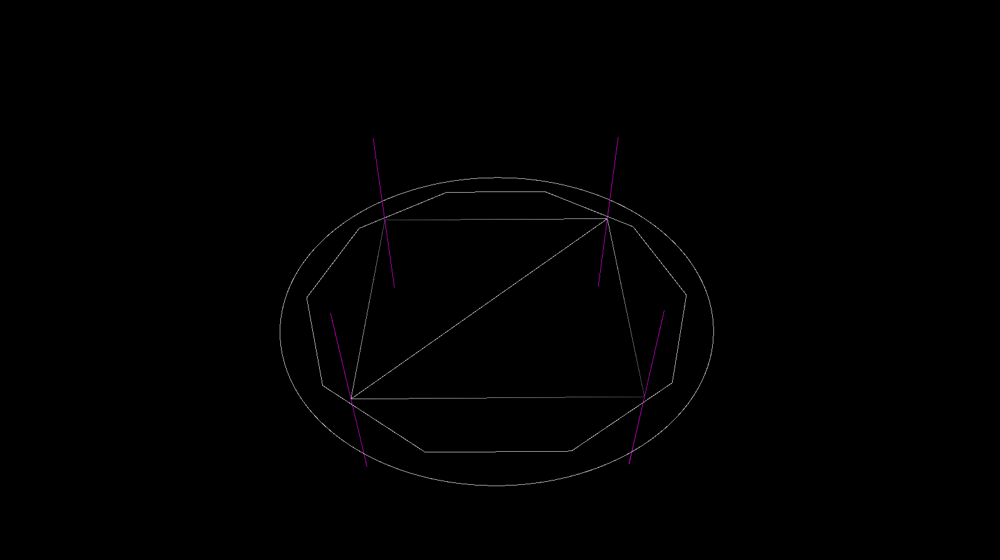
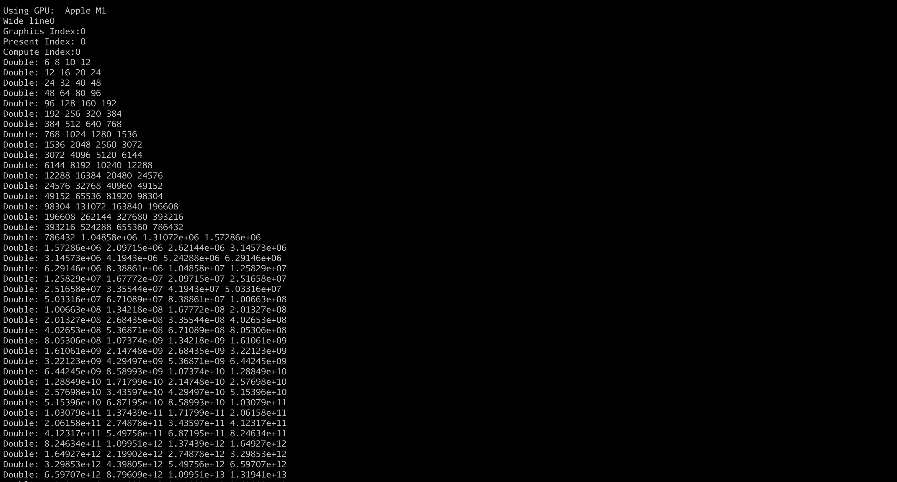

# VulkanRenderDemo
3D-Rendering of Vulkan 

CMake Files: (MacOS required Vulkan,GLM,GLFW)

create a floder named build

cd build then cmd: cmake [[Custom params]](###Cmake params) ..

cmd 'make'

after all, it will create a executable program named VulkanTestDemo

### Cmake params

-DCMAKE_BUILD_TYPE=[CMAKE_BUILD_TYPE]
-DLOG_LEVEL=[LOG_LEVEL]

**CMAKE_BUILD_TYPE: **

* Release
* Debug

**LOG_LEVEL:**

* INFO 
* DEBUG 
* WARN 
* ERROR
* FATAL 

## Warn: Under refactory 
By far, impl Triangle renderer.

2023.11.06：Mesh、Material、Texture、Light、ComputeShader

The foundational functions have finished.

If your plants form is Windows, you could compile shaders by compile_shader.bat. (Dont forget set current VulkanSDK path)

## Example shortcut

mutiple_models 

light_shader 

mesh_grid 

draw_common_shape

compute_shader_calculation 

## 3rd-Libraries

Vulkan: https://www.vulkan.org

GLFW: https://github.com/glfw/glfw

stb-master: https://github.com/nothings/stb

tinyobjloader: https://github.com/tinyobjloader/tinyobjloader

UncleDon-Logger: https://github.com/DYYYYYYYF/UncleDon-Logger

ThreadPool: https://github.com/DYYYYYYYF/ThreadPool

