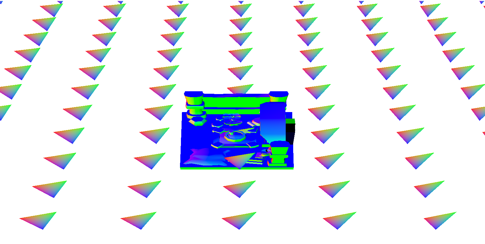
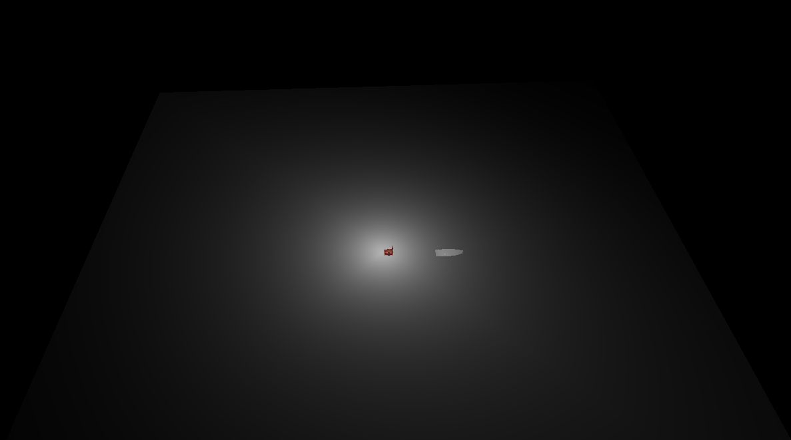
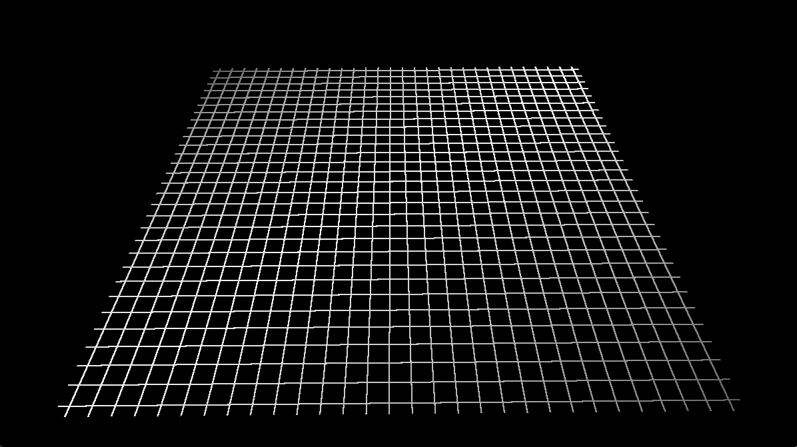

# VulkanRenderDemo
3D-Rendering of Vulkan 

CMake Files: (MacOS required Vulkan,GLM,GLFW)

create a floder named build

cd build then cmd 'cmake ..'

cmd 'make'

after all, it will create a executable program named VulkanTestDemo

## Warn: Under refactory 
By far, impl Triangle renderer.

2023.11.06：Mesh、Material、Texture

The foundational functions have finished.

If your plants form is Windows, you could compile shaders by compile_shader.bat. (Dont forget set current VulkanSDK path)

### Example shortcut

mutiple_models

light_shader

mesh_grid

## 3rd-Libraries

GLFW: https://github.com/glfw/glfw
stb-master: https://github.com/nothings/stb
tinyobjloader: https://github.com/tinyobjloader/tinyobjloader
UncleDon-Logger: https://github.com/DYYYYYYYF/UncleDon-Logger
ThreadPool: https://github.com/DYYYYYYYF/ThreadPool
